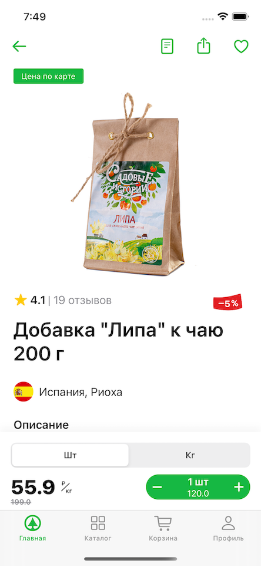

## Экран карточки товара приложения **"Мой Spar"**

Экран сделан на **UIKit** по архитектуре **MVP** с использованием паттерна **Builder**. Получение данных реализовано через моковую модель, вместо сетевого слоя.
#### Использованный стек:

- UIKit
- MVP
- `UITableViewDiffableDataSource`
- `UICollectionViewDiffableDataSource`
- Min iOS - 14

#### Что можно было бы улучшить (Тех. долг):
- Разбить  таблицу на несколько ячеек, а не на одну массивную `ItemTableViewCell`
- Можно было весь экран сделать с помощью `UICollectionView` и `UICollectionViewCompositionalLayout`, но я решил показать навык работы с `UITableView` и `UICollectionView`. 
- Продумать более лаконичный способ прокидывания данных в `BottomView`. Т.е. не прокидывать всю модель. 
- Сделать более гибкую настойку кастомной `MeasurementUnitsView` (₽/кг)
